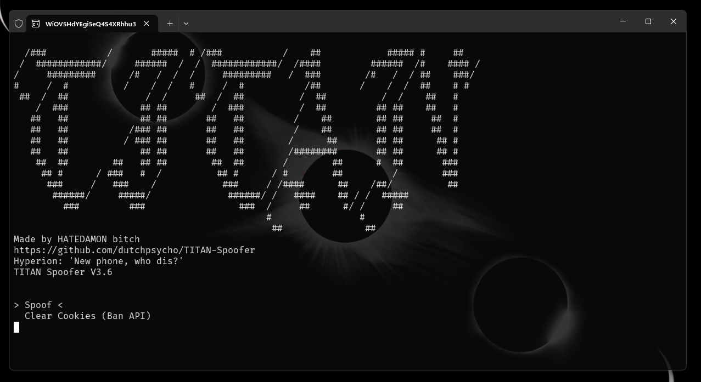

# TITAN Spoofer (Roblox, Hyperion)

*TITAN © 2024 by Damon is licensed under CC BY-NC-ND 4.0*



**[TITAN's](https://discord.gg/yUWyvT9JyP)** Spoofer is a tool designed to spoof various hardware identifiers (HWIDs) and cookies on your system to evade Roblox's detection mechanisms and ban API.

[](https://creativecommons.org/licenses/by-nc-nd/4.0/)
[](https://discord.gg/yUWyvT9JyP)

## Disclaimer ⚠️

This software is intended for educational and research purposes only. Using this tool to bypass security measures or violate the terms of service of any software, including Roblox, is strictly prohibited. The developers do not endorse or support any illegal activities and will not be held responsible for any misuse of this software.

## Features 💎

- **System Spoofing** 🛡️ Spoofs keys and cleans files that Roblox and Hyperion use to detect alternative accounts.
- **Roblox Cookie Cache Cleaner** 🍪 Cleans Roblox.com cookies from a specified browser.
- **Headless/NonHeadless** ⚙️ Compile the spoofer without a UI so it can be put in startup / ran quicker. This is controlled by the ``#define`` in ``Master.cpp``
- **No System Instability** 🖥️ This spoofer doesn't spoof anything that'll break anything on your PC. It operates in UserMode, not the Kernel.

Read -> [INFO.md](INFO.md) <- for additional details on how the executables operate, what they depend on and what you can do with them.

## Installation 📂

If you prefer not to compile the code yourself, you can download the exe's from **[TITAN's Discord](https://discord.gg/yUWyvT9JyP)** Otherwise, follow the guide below.

1. **Clone the repository:**

    ```sh
    git clone https://github.com/dutchpsycho/TITAN-Spoofer.git
    cd TITAN-Spoofer
    ```

2. **Open the Solution File (.sln):**

   - Launch Visual Studio (The purple one, not blue)
   - Navigate to the directory where the repository was cloned.
   - Open the `TITAN Spoofer.sln` file.

3. **Configure Build Settings:**

   - Ensure that the build configuration is set to `Release` mode.
   - Select the appropriate platform (`x64`).

4. **Build the Project:**

   - Click on `Build > Build Solution` in the Visual Studio menu.
   - The compiled binaries will be located in the `/x64/Release` directory.

## Requirements ⚠️

- Windows OS 10/11 x64
- .NET Framework 4.0+
- Visual Studio with C++ Development tools installed

## Usage 💻

1. Run the compiled ``TITAN Spoofer.exe``
